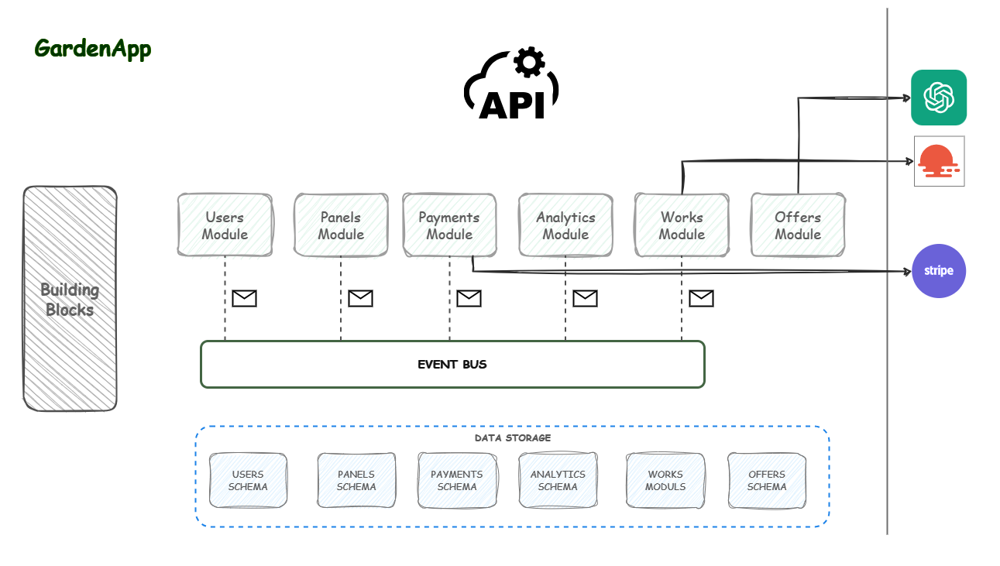

# GardenApp Modular Monolith 

---

<div align="center">
  
</div>

---


 
Contemporary gardening companies often face challenges related to efficient work organization and presenting their achievements to potential clients. They don't have the tools to track their work performance effectively or to show completed projects.
The application has been designed to automate key processes in gardening companies and support decision-making. Additionally, it provides customer-oriented functionalities, allowing for direct interaction with clients.
Thanks to the application gardening companies can manage their resources better, keep track of project progress, and present their achievements in a professional and convincing manner.




### Run using Docker Compose

You can run the necessary dependencies to check the current state of application using [docker compose](https://docs.docker.com/compose/), currently excluding volumes:

```shell
docker-compose -f docker-compose.yml up -d
```

It will create following services: <br/>

- PostgreSQL
- pgAdmin
- smtp4dev
- SEQ
- Minio

## Features

### Users Module
- **Registration**: Creating a new account.
- **Login**: Login to access the system. 
- **Password Reset**: Password operations (remind or update)
- **Account Management**: Updating user details or deleting an account.

### Offers Module
- **Gardening Offers Management**: CRUD operations to manage gardening service offers.

### Panels Module
- **Display Management**: Project presentations with CRUD operations.

### Analytics Module
- **Work Reports**: Generating detailed reports of completed and pending works, with comparisons to previous periods.
- **Download**: Exporting analytical reports.
- **Work Duration Prediction**: Using historical data to estimate the time needed to complete specific works.
- **Client Behavior Prediction**: Analyzing patterns to predict customer requests and preferences.

### Payments Module
- **Subscription Management**: Recurring payments for continued service access.
- **Payment Flexibility**: Deleting recurring payments.

### Works Module
- **Work Scheduling**: Management and scheduling gardening works based on real-time weather conditions via integration with a weather API. 
- **Work History**: Tracking the history of all completed works for future reference and analytics.

---


## Technologies

- ASP.NET Core 6.0 WebAPI 
- .NET Core 6.0

## Architecture

Each Module has Clean Architecture and consists of the following submodules (assemblies):

- **Application** - This submodule handles the logic for processing requests
- **Domain** - Contains the core business logic and rules. This layer defines entities, value objects, and domain events, encapsulating the essential concepts and operations of the application
- **Infrastructure** - Responsible for communication with external services and for background processing and data access

## Patterns

- CQRS
- Transactional Outbox and Inbox  - this pattern provides "At-Least-Once delivery" and "At-Least-Once processing"

[TODO]
Client module
