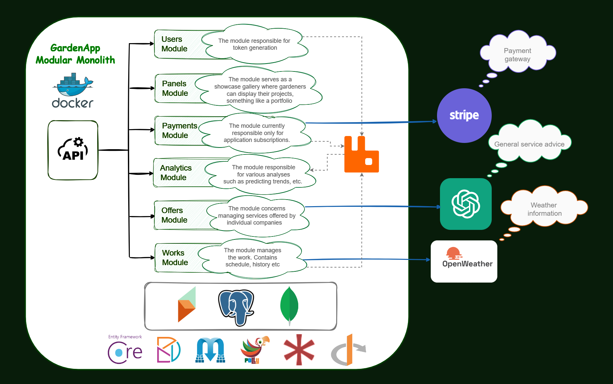

#GardenApp Modular Monolith 

Contemporary gardening companies often face challenges related to efficient work organization and presenting their achievements to potential clients. They don't have the tools to track their work performance effectively or to show completed projects.
The application has been designed to automate key processes in gardening companies and support decision-making. Additionally, it provides customer-oriented functionalities, allowing for direct interaction with clients.
Thanks to the application gardening companies can manage their resources better, keep track of project progress, and present their achievements in a professional and convincing manner.

